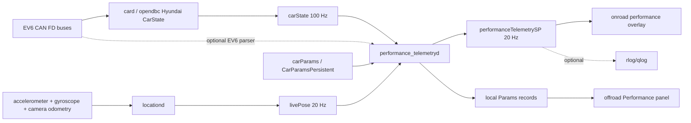

# EV6 Performance Telemetry Architecture

Date: 2026-05-15

Status: architecture plan only. No implementation has been started.

Scope: Kia EV6 only. The design intentionally does not attempt to support every Hyundai/Kia CAN FD platform.

## Goal

Build a read-only performance telemetry applet for the Kia EV6 that can:

- Time standing-start acceleration runs such as 0-60 mph.
- Show current and peak longitudinal acceleration.
- Show current and peak lateral acceleration in g.
- Store a small local history of completed runs and best values.
- Provide an onroad overlay that can be enabled/configured from offroad settings.

The feature must not influence control, planning, actuation, safety hooks, or CAN output. It should observe already available vehicle/device data and publish a derived telemetry service for UI and optional logs.

## Non-Goals

- No support matrix for non-EV6 vehicles.
- No CAN transmission.
- No changes to planner, controlsd, carcontroller, or panda safety behavior.
- No cloud product, leaderboard, sharing flow, or automatic upload of summary files.
- No tuning of EV6 longitudinal/lateral control.
- No instrument certification claim. The first version should report confidence and source flags rather than implying laboratory-grade measurement.

## Code Facts Checked

These are the repo facts this plan is based on:

- EV6 is represented by `CAR.KIA_EV6` with CAN FD and EV flags, and has specs `mass=2055`, `wheelbase=2.9`, `steerRatio=13.43` in `opendbc_repo/opendbc/car/hyundai/values.py`.
- EV6 uses the generated Hyundai CAN FD DBC (`hyundai_canfd_generated`), verified by importing `CAR`, `CANFD_CAR`, `EV_CAR`, and `DBC` in the desktop Python environment.
- Hyundai CAN FD `CarState.update_canfd()` already parses:
  - accelerator state from `ACCELERATOR`
  - brake state from `TCS.DriverBraking`
  - wheel speeds from `WHEEL_SPEEDS`
  - steering angle/rate from `STEERING_SENSORS`
  - dashboard speed-limit extras from `FR_CMR_02_100ms`
  See `opendbc_repo/opendbc/car/hyundai/carstate.py`.
- `parse_wheel_speeds()` computes `vEgoRaw`, `vEgo`, and `aEgo` from wheel speeds in `opendbc_repo/opendbc/car/interfaces.py`.
- `TCS.aBasis` exists in the CAN FD DBC and is read into `CarStateExt.aBasis`, but it is not currently exposed on a cereal message.
- `carState.yawRate` exists in `cereal/car.capnp`, but the Hyundai/EV6 path in this repo does not populate it.
- `livePose` publishes device-frame acceleration and angular velocity at 20 Hz. `locationd` fills `livePose.accelerationDevice` and `livePose.angularVelocityDevice` from accelerometer/gyro/camera odometry.
- `torqued.py` already computes lateral acceleration from calibrated yaw rate and roll using `lateral_acc = vEgo * yaw_rate - sin(roll) * g`. That is the best repo-native starting point for EV6 lateral g.
- Cereal has SP/custom expansion points. `customReserved14 @140` in `cereal/log.capnp` is available for a new named SP service without changing existing field ids.
- The Sunnypilot UI already subscribes to SP services in `selfdrive/ui/sunnypilot/ui.cc`, and `HudRendererSP` draws SP-specific overlays after the base HUD.
- Offroad settings include a top-level `Trips` panel and a `Visuals` panel. The settings menu is assembled in `selfdrive/ui/sunnypilot/qt/offroad/settings/settings.cc`.
- A full Hyundai interface import failed in this desktop environment because `crcmod` is not installed. That is an environment limitation for local smoke probes, not evidence against the EV6 code path. Implementation verification should run in the repo's normal Linux/tici environment.

## Proposed System Shape



The key architectural choice is to make a separate read-only daemon rather than embedding the timing logic in UI. The daemon sees 100 Hz `carState`, uses message timestamps rather than UI frame timing, and publishes already-computed state for rendering.

## Recommended File Ownership

Daemon and logic:

- `sunnypilot/performance_telemetry/__init__.py`
- `sunnypilot/performance_telemetry/performance_telemetryd.py`
- `sunnypilot/performance_telemetry/launch_timer.py`
- `sunnypilot/performance_telemetry/motion_metrics.py`
- `sunnypilot/performance_telemetry/ev6_can.py`
- `sunnypilot/performance_telemetry/storage.py`

Tests:

- `sunnypilot/performance_telemetry/tests/test_launch_timer.py`
- `sunnypilot/performance_telemetry/tests/test_motion_metrics.py`
- `sunnypilot/performance_telemetry/tests/test_storage.py`

Cereal:

- `cereal/custom.capnp`
- `cereal/log.capnp`
- `cereal/services.py`

Process lifecycle:

- `system/manager/process_config.py`

UI:

- `selfdrive/ui/sunnypilot/ui.cc`
- `selfdrive/ui/sunnypilot/qt/onroad/performance_telemetry.h`
- `selfdrive/ui/sunnypilot/qt/onroad/performance_telemetry.cc`
- `selfdrive/ui/sunnypilot/qt/onroad/hud.h`
- `selfdrive/ui/sunnypilot/qt/onroad/hud.cc`
- `selfdrive/ui/sunnypilot/qt/offroad/settings/performance_panel.h`
- `selfdrive/ui/sunnypilot/qt/offroad/settings/performance_panel.cc`
- `selfdrive/ui/sunnypilot/qt/offroad/settings/settings.cc`
- `selfdrive/ui/sunnypilot/SConscript`

Params:

- `common/params_keys.h`

This keeps measurement logic in Python where unit tests can exercise it without Qt, and keeps Qt focused on presentation and settings.

## Process Lifecycle

Add a manager predicate:

```python
def performance_telemetry_enabled(started: bool, params: Params, CP: car.CarParams) -> bool:
  return (
    started
    and not CP.notCar
    and CP.carFingerprint == "KIA_EV6"
    and params.get_bool("PerformanceTelemetryEnabled")
  )
```

Add process:

```python
PythonProcess("performance_telemetryd", "sunnypilot.performance_telemetry.performance_telemetryd", performance_telemetry_enabled)
```

Rationale:

- Runs only onroad.
- Runs only for the EV6.
- Stops when the user disables the feature.
- Does not add work for other vehicles or PC/notcar replay sessions.
- Has manager visibility through `managerState`.

If UI should still show last-recorded results offroad, the offroad panel reads persisted Params, not the daemon.

## Cereal Service

Add a new custom struct by renaming an available reserved custom field:

- `cereal/custom.capnp`: add `struct PerformanceTelemetrySP`.
- `cereal/log.capnp`: rename `customReserved14 @140` to `performanceTelemetrySP @140 :Custom.PerformanceTelemetrySP`.
- `cereal/services.py`: add `performanceTelemetrySP`.

Recommended service settings:

```python
"performanceTelemetrySP": (True, 20., 5)
```

This publishes at `livePose` cadence and logs to qlog at about 4 Hz. The daemon still processes `carState` internally at 100 Hz for timing precision. If privacy is prioritized over replay convenience, set `should_log=False` before the first shipped version and rely on local Params for records.

### Message Sketch

The exact field ids should be assigned during implementation, but this is the intended data shape:

```capnp
struct PerformanceTelemetrySP {
  schemaVersion @0 :UInt16;

  available @1 :Bool;
  enabled @2 :Bool;
  valid @3 :Bool;
  carFingerprint @4 :Text;

  state @5 :State;
  invalidReason @6 :InvalidReason;
  confidence @7 :Confidence;

  speedMps @8 :Float32;
  speedMph @9 :Float32;
  accelLongMps2 @10 :Float32;
  accelLongG @11 :Float32;
  accelLatMps2 @12 :Float32;
  accelLatG @13 :Float32;
  jerkLongMps3 @14 :Float32;

  peakAccelLongG @15 :Float32;
  peakBrakeLongG @16 :Float32;
  peakLeftLatG @17 :Float32;
  peakRightLatG @18 :Float32;
  peakAbsLatG @19 :Float32;

  launch @20 :LaunchRun;
  lastRun @21 :LaunchResult;
  bestRun @22 :LaunchResult;

  source @23 :SourceStatus;

  enum State {
    unavailable @0;
    idle @1;
    armed @2;
    running @3;
    complete @4;
    invalid @5;
  }

  enum InvalidReason {
    none @0;
    notEv6 @1;
    disabled @2;
    carStateInvalid @3;
    livePoseInvalid @4;
    startedAboveThreshold @5;
    timeout @6;
    brakePressed @7;
    gearInvalid @8;
    wheelSlipLikely @9;
    serviceDropout @10;
  }

  enum Confidence {
    unknown @0;
    high @1;
    medium @2;
    low @3;
  }

  struct LaunchRun {
    active @0 :Bool;
    elapsedS @1 :Float32;
    startMonoTimeNanos @2 :UInt64;
    startSpeedMps @3 :Float32;
    targetSpeedMps @4 :Float32;
    currentSpeedMps @5 :Float32;
    currentDistanceM @6 :Float32;
    wheelSlipLikely @7 :Bool;
    lateralMotionLikely @8 :Bool;
  }

  struct LaunchResult {
    valid @0 :Bool;
    elapsedS @1 :Float32;
    targetSpeedMps @2 :Float32;
    distanceM @3 :Float32;
    completedMonoTimeNanos @4 :UInt64;
    peakAccelG @5 :Float32;
    confidence @6 :Confidence;
    flags @7 :List(Text);
  }

  struct SourceStatus {
    carStateAlive @0 :Bool;
    carStateValid @1 :Bool;
    livePoseAlive @2 :Bool;
    livePoseValid @3 :Bool;
    rawCanAlive @4 :Bool;
    usingRawCan @5 :Bool;
    usingLivePoseLateral @6 :Bool;
    usingWheelSpeedTiming @7 :Bool;
  }
}
```

Avoid embedding route ids, location, VIN, device serial, or raw CAN payloads in this message.

## Inputs

### Required

`carState` at 100 Hz:

- `vEgoRaw`: primary timing speed for 0-60.
- `vEgo`: filtered display speed fallback.
- `aEgo`: first longitudinal acceleration source.
- `wheelSpeeds`: wheel-slip and confidence checks.
- `standstill`: arming condition.
- `gasPressed`: launch intent hint.
- `brakePressed`: invalidation or staging guard.
- `gearShifter`: drive/invalid guard.
- `steeringAngleDeg` and `steeringRateDeg`: lateral-motion sanity flags.

`livePose` at 20 Hz:

- `angularVelocityDevice`: yaw-rate source after calibration.
- `accelerationDevice`: optional acceleration cross-check.
- `orientationNED`: roll estimate for gravity compensation.
- `inputsOK`, `posenetOK`, `sensorsOK`: validity gates.

`liveCalibration` if the daemon uses `PoseCalibrator` directly:

- `rpyCalib`
- `calStatus`

`carParams`:

- confirm `KIA_EV6`
- read `wheelSpeedFactor` if needed
- verify not notCar

### Optional EV6 Raw CAN Parser

An EV6-only raw CAN parser inside `performance_telemetryd` can decode a tiny allowlist from the Hyundai CAN FD DBC:

- `WHEEL_SPEEDS`: individual wheel speeds for slip detection without waiting on `carState`.
- `TCS.aBasis`: vehicle-reported longitudinal acceleration basis.
- `ACCELERATOR.ACCELERATOR_PEDAL`: pedal position, not just boolean pedal state.

This parser should be optional and fail without disabling 0-60 timing. The MVP can use `carState` plus `livePose`; raw CAN improves confidence labels and diagnostic displays.

## Timing Model For 0-60

Use monotonic event timestamps from the subscribed message, not UI frame time or wall clock.

Primary timestamp source:

- `sm.logMonoTime["carState"]`

Target speed:

- 60 mph = `26.8224 m/s`

Default launch mode:

- "True 0-60": no rollout subtraction.

Optional later mode:

- "1 ft rollout": useful for comparison with drag-strip style consumer devices, but should not be the default if the user asks for true 0-60.

### State Machine

States:

- `unavailable`: not EV6, missing services, or disabled.
- `idle`: enabled and waiting.
- `armed`: EV6 is stopped and in a valid launch-ready state.
- `running`: start threshold crossed.
- `complete`: target speed crossed and result captured.
- `invalid`: run was rejected or marked unusable.

Arming requirements:

- `CP.carFingerprint == "KIA_EV6"`
- `carState.valid`
- `carState.standstill` or `vEgoRaw <= 0.2 m/s`
- gear is drive
- brake not pressed, or brake release is observed before launch
- no recent service dropout

Start detection:

- Keep a short ring buffer of `carState` samples while armed.
- Start when `vEgoRaw` crosses a small threshold, recommended `0.3 m/s`.
- Interpolate the start-crossing timestamp between the last sample below threshold and the first sample above it.

Completion detection:

- Detect target crossing when `vEgoRaw` crosses `26.8224 m/s`.
- Interpolate the target-crossing timestamp.
- Result time is `target_cross_time - start_cross_time`.

Distance:

- Integrate speed using trapezoidal integration over the same sample window.
- Report distance at target crossing as context, not as a certified quarter-mile distance unless the distance target state machine is added.

Invalidation:

- `carState` invalid or stale for more than 100 ms while running.
- gear leaves drive.
- brake pressed during run, unless the user explicitly wants braking metrics.
- timeout, recommended 20 seconds for 0-60.
- starts above the start threshold without an armed standstill.
- speed goes negative or jumps by an impossible amount.

Confidence flags:

- `wheelSlipLikely`: individual wheel speeds diverge by more than either an absolute threshold or percentage threshold for several frames.
- `lateralMotionLikely`: sustained lateral g above about 0.15 g during a 0-60 run.
- `lowPoseConfidence`: `livePose` validity flags are not all good.
- `filteredSpeedFallback`: daemon had to use `vEgo` instead of `vEgoRaw`.
- `rawCanUnavailable`: optional EV6 CAN parser did not produce fresh values.

The first version should not automatically discard every wheel-slip run. For an EV, wheel slip may be exactly the thing the user wants to see. Mark the confidence and let the UI show why the number may be optimistic.

## Lateral And Longitudinal G

Use `g = 9.80665 m/s^2`.

### Longitudinal G

Source priority:

1. EV6 raw `TCS.aBasis` if the optional raw parser is enabled and fresh.
2. `carState.aEgo` from wheel-speed Kalman output.
3. `livePose.accelerationDevice` transformed into calibrated frame as a cross-check, not the primary source until validated on device.

Track:

- current longitudinal g
- peak acceleration g
- peak braking g
- moving average over 250 ms for display
- raw instantaneous value for internal peak capture with sanity gates

Display should show both current and peak values. Use a short display smoothing constant so the UI is readable without hiding real peaks in the stored result.

### Lateral G

Primary source:

- Use the existing repo pattern from `torqued.py`: calibrated yaw rate from `livePose`, speed from `carState`, and roll gravity compensation.

Formula:

```text
lateral_accel_mps2 = v_ego_mps * yaw_rate_radps - sin(roll_rad) * 9.80665
lateral_g = lateral_accel_mps2 / 9.80665
```

Why this source:

- Hyundai EV6 `carState.yawRate` is not populated in this repo.
- The generated Hyundai CAN FD DBC does not expose the older generic `TCS11` lateral/yaw signals.
- `livePose` and `PoseCalibrator` already exist and are used by location/torque learning code.

Track:

- current lateral g
- peak left lateral g
- peak right lateral g
- peak absolute lateral g
- 250 ms display average
- confidence based on `livePose` validity and calibration status

Future EV6 refinement:

- If a real EV6 log shows ESC lateral acceleration or yaw-rate signals on raw CAN that are not represented in the generated DBC, add an EV6-specific DBC decode and compare it against `livePose` before making it a primary source.

## Daemon Design

`performance_telemetryd.py` should be a thin loop around small testable classes.

Subscriptions:

```python
sm = messaging.SubMaster(
  ["carState", "livePose", "liveCalibration", "carParams", "can"],
  poll="carState",
  ignore_alive=["can"],  # only if raw CAN parser is optional
)
pm = messaging.PubMaster(["performanceTelemetrySP"])
```

Loop:

- Poll on `carState` to see every 100 Hz speed sample.
- Update launch timer on every fresh `carState`.
- Update lateral metrics when `livePose` is fresh.
- Update optional raw CAN parser when `can` is fresh.
- Publish `performanceTelemetrySP` at 20 Hz or whenever state transitions.
- Persist records only when a run completes or a best value changes.

Internal classes:

- `LaunchTimer`: state machine, interpolation, invalidation, result creation.
- `MotionMetrics`: longitudinal/lateral g, smoothing, peaks, confidence.
- `EV6CanParser`: optional tiny raw-CAN parser for `TCS.aBasis`, pedal position, individual wheel speed freshness.
- `TelemetryStore`: local Params JSON for last runs and bests.
- `TelemetryPublisher`: converts internal dataclasses to cereal fields.

Threading:

- Single thread.
- No timers outside the main loop.
- No blocking disk I/O except small Params writes on completed runs.

Failure behavior:

- If the daemon raises during a sample update, publish an unavailable/invalid message rather than crashing repeatedly.
- If services are stale, reset active runs and report source status.
- If Params JSON is corrupt, ignore it, start a new empty history, and leave a cloudlog warning.

## Local Storage

Use Params for small records.

Preferences:

- `PerformanceTelemetryEnabled`: `PERSISTENT | BACKUP`, bool, default `0`.
- `PerformanceTelemetryOverlayMode`: `PERSISTENT | BACKUP`, int, default `1`.
- `PerformanceTelemetryStoreRuns`: `PERSISTENT | BACKUP`, bool, default `1`.
- `PerformanceTelemetryUseOneFootRollout`: `PERSISTENT | BACKUP`, bool, default `0`.
- `PerformanceTelemetryRawCan`: `PERSISTENT | BACKUP`, bool, default `1`.

Records:

- `PerformanceTelemetryLastRun`: `PERSISTENT`, JSON.
- `PerformanceTelemetryBestRuns`: `PERSISTENT`, JSON.
- `PerformanceTelemetryRunHistory`: `PERSISTENT`, JSON capped to a small number, recommended 20 entries.

Do not mark run records as `BACKUP` by default. Performance runs are personal driving behavior, and backups can move Params off-device depending on the user's setup.

Example stored record:

```json
{
  "schema_version": 1,
  "completed_at_mono_ns": 123456789000,
  "target_speed_mps": 26.8224,
  "elapsed_s": 4.37,
  "distance_m": 79.4,
  "peak_accel_g": 0.62,
  "peak_lateral_g": 0.04,
  "confidence": "medium",
  "flags": ["wheelSlipLikely"]
}
```

Do not store:

- route id
- dongle id
- GPS coordinates
- VIN
- raw CAN
- full speed traces

If later analysis needs full traces, use normal rlogs or a developer-only artifact path under `.cache/` on the dev machine after manual pull.

## Offroad UI

Recommended placement:

- Add a top-level `Performance` panel after `Trips`.
- Keep the panel visible only when `CarParamsPersistent` resolves to `KIA_EV6`, or show a disabled state that says the suite is available for Kia EV6 only.

Why a top-level panel:

- The existing `Trips` panel is for cloud drive stats and can later link to performance history, but performance telemetry has enable, privacy, overlay mode, records, and reset controls.
- `Vehicle > Hyundai` is mostly vehicle tuning. Performance telemetry is an applet, not tuning.
- `Visuals` can expose a small overlay-mode shortcut later, but should not own records/history.

Panel contents:

- Main enable toggle.
- Overlay mode segmented control:
  - Off
  - Compact
  - Expanded
  - Run Only
- Timing mode:
  - True 0-60
  - 1 ft rollout
- Store run history toggle.
- Raw EV6 CAN refinement toggle.
- Best 0-60 value.
- Last run summary.
- Peak lateral g left/right.
- Peak longitudinal acceleration/braking g.
- Reset records button with confirmation.

Follow the offroad settings guide:

- Use `ParamControlSP`, `ButtonParamControlSP`, `ButtonControlSP`, and `ToggleSP`.
- Use the section-card layout, margins, fonts, and amber modified-state language from `docs/chauffeur/ui/bsg/offroad/offroad_settings_bsg.md`.
- Persist on interaction and refresh from Params in `showEvent`.
- Disable controls while onroad when changing them would affect daemon lifecycle or overlay mode.

## Onroad Overlay

Recommended ownership:

- Add `PerformanceTelemetryRenderer` as its own Qt class.
- `HudRendererSP` owns or calls it, but the telemetry drawing/state should live outside the already-large RTI/weather/VTSC HUD code.
- Add `performanceTelemetrySP` to `UIStateSP` subscriptions in `selfdrive/ui/sunnypilot/ui.cc`.

Rendering order:

- Weather/road geometry overlays remain below base HUD.
- Base HUD remains responsible for speed, set speed, SLC, road name, and stock elements.
- Performance overlay should draw after base HUD but before RTI threat cards, unless the overlay is in `Run Only` mode and actively timing a launch.

Placement:

- Compact mode: small right-side vertical stack with current g and peak g.
- Expanded mode: right lower panel with current speed, run timer, longitudinal g, lateral g, and last/best 0-60.
- Run Only mode: hidden until armed/running/complete, then visible for the run and a short completion hold.

Alert behavior:

- Hide or collapse during full-width alerts.
- Collapse when driver monitoring alert presentation needs visual priority.
- Never cover current speed, set speed, SLC signs, or RTI threat cards.
- No onroad settings controls. Display only.

Display values:

- Speed: mph or km/h from `IsMetric`.
- 0-60 timer: seconds with two decimals while running, completed result with two decimals.
- G meters: signed current value plus peak value.
- Confidence: compact icon/short label only, no long explanations while driving.

Do not render coaching copy such as launch instructions or prompts to accelerate.

## Accuracy Notes

### 0-60

Wheel-speed timing at 100 Hz with interpolation should be highly repeatable. It is usually better than phone GPS for launch timing. It is still affected by:

- tire size
- OEM wheel-speed scaling
- wheel slip
- non-stock tire/wheel changes
- road grade
- speed source filtering if fallback is used

The daemon should report source/confidence flags so the UI can distinguish a high-confidence run from a wheel-slip run.

### Lateral G

The initial lateral-g estimate should be good enough for a driver-facing performance applet, but it is derived:

- yaw rate comes from device pose, not EV6 CAN
- speed comes from wheel speed
- roll compensation depends on pose/calibration validity

Validation should compare:

- steady-state circular driving at a known approximate radius
- left and right turns for sign consistency
- livePose-derived lateral g against any discovered EV6 ESC signal, if found later

### Longitudinal G

`carState.aEgo` is filtered and may lag sharp launch peaks. `TCS.aBasis` should be evaluated on the EV6 because it may provide a better current acceleration display. Stored 0-60 time should still be based on speed crossing, not acceleration integration.

## Privacy And Logging

The raw ingredients for performance analysis are already in normal logs (`carState`, sensors, and CAN), but an explicit performance service makes launch events easier to identify.

Recommended policy before shipping:

- Preferences may be backed up.
- Run records should stay local and not be marked `BACKUP`.
- Summary records should not include route ids or location.
- If `performanceTelemetrySP` is logged, document that completed run summaries may appear in rlogs/qlogs.
- If the user wants maximum local privacy, set `performanceTelemetrySP` `should_log=False` and rely on Params for records.

Development default can be logged to simplify replay verification. User-facing default should be decided before implementation lands.

## Verification Plan

### Unit

Launch timer:

- starts only from an armed standstill
- interpolates start threshold crossing
- interpolates target speed crossing
- handles exactly-on-target samples
- invalidates stale `carState`
- invalidates gear/brake/timeouts
- reports wheel-slip flags without losing valid result unless configured to reject
- produces deterministic results from synthetic 100 Hz samples

Motion metrics:

- converts m/s^2 to g
- tracks left/right/absolute lateral peaks
- applies roll compensation formula
- rejects invalid `livePose`
- verifies display smoothing does not change stored peaks

Storage:

- corrupt Params JSON recovery
- capped history length
- best-run replacement only when same target and lower elapsed time
- preferences and records use the intended Params flags

### Static And Build

- `python -m pytest -q cereal/messaging/tests/test_services.py`
- `python -m pytest -q system/manager/test/test_manager.py`
- `python -m pytest -q sunnypilot/performance_telemetry/tests`
- `python -m pytest -q selfdrive/ui/tests/test_ui`
- `scons -j$(nproc)` in the Linux/tici build environment

### Replay

Use EV6 routes from existing local test material where available.

Replay checks:

- daemon starts only for `KIA_EV6`
- no output when disabled
- output is deterministic for the same route
- frequency is near 20 Hz
- no source dropouts on normal EV6 logs
- lateral g sign is stable through left/right turns
- 0-60 synthetic segment result matches expected interpolation

If process replay is added, add a `ProcessConfig` for `performance_telemetryd` with:

- pubs: `performanceTelemetrySP`
- subs: `carState`, `livePose`, `liveCalibration`, `carParams`, optional `can`
- main pub: `carState`

### Device Smoke

On tici:

- Enable the Params toggle while offroad.
- Go onroad in EV6.
- Confirm `managerState` shows `performance_telemetryd` should be running.
- Confirm `performanceTelemetrySP` publishes at about 20 Hz.
- Confirm UI draw timing stays below existing onroad budget.
- Confirm CPU addition is small enough to update `selfdrive/test/test_onroad.py` budgets if that process becomes part of the expected set.
- Confirm no sendcan changes and no new control events.
- Confirm disabling the toggle stops the daemon on next manager cycle.

### Road Validation

Use safe/private-road runs only.

Minimum validation set:

- stationary arming with brake held and released
- slow roll that should not count as true 0-60
- normal launch to 30 mph and abort
- launch to 60 mph
- launch with obvious wheel spin or traction intervention
- left and right steady turns
- hard regen/brake event for peak braking g

Expected artifacts:

- small notes under `docs/chauffeur/performance_telemetry/`
- raw pulled logs under `.cache/` only
- no route ids or personal drive logs committed

## Implementation Phases

### Phase 1: Logic Without UI

- Add Python classes and tests.
- Use synthetic samples only.
- No cereal changes yet if possible; publish can wait.

Acceptance:

- deterministic 0-60 results from synthetic traces
- lateral/longitudinal g math covered

### Phase 2: Cereal And Daemon

- Add `PerformanceTelemetrySP`.
- Add service entry.
- Add manager process gated to EV6 and feature toggle.
- Publish live telemetry.

Acceptance:

- service tests pass
- manager duplicate/blacklist tests pass
- daemon can run in replay/simulation without UI

### Phase 3: Offroad Panel And Local Records

- Add Performance panel.
- Add Params keys.
- Show last/best values from Params.
- Add reset confirmation.

Acceptance:

- UI test screenshots cover panel
- records persist across process restart
- records do not include route/location identifiers

### Phase 4: Onroad Overlay

- Add renderer and `UIStateSP` subscription.
- Implement compact/run-only overlay.
- Verify no overlap with speed/set-speed/SLC/RTI/alerts.

Acceptance:

- local UI screenshot checks
- tici UI draw timing remains within budget
- overlay hides/collapses during high-priority alerts

### Phase 5: EV6 Raw CAN Refinement

- Add optional raw parser for `TCS.aBasis`, wheel-speed spread, and pedal position.
- Compare raw-parser values to `carState` and `livePose`.
- Decide whether `TCS.aBasis` becomes primary longitudinal-g display.

Acceptance:

- raw parser failure does not break timing
- source status reports raw CAN freshness
- replay/device comparison documented

## Open Decisions

- Whether `performanceTelemetrySP` should be logged by default.
- Whether to add a top-level `Performance` panel or extend `Trips` for history while putting controls in `Visuals`.
- Whether one-foot rollout should exist in the first implementation or wait until after true 0-60 works.
- Whether wheel slip should invalidate runs by default or only lower confidence.
- Whether EV6 raw `TCS.aBasis` is stable enough to expose as the primary longitudinal g source.
- Whether records should survive backup/restore. Recommended answer: preferences yes, run records no.

## Staff-Engineer Review Questions

- Does any part of the feature run when not EV6? It should not.
- Does any part of the feature publish/send CAN? It must not.
- Can a UI crash affect control? The daemon should be independent, and UI should only subscribe.
- Can a daemon crash spam logs or manager restarts? Add guarded update paths and low-volume warnings.
- Are source timestamps used instead of UI/wall-clock timestamps? They must be.
- Are completed run records bounded in size? They must be.
- Are personal identifiers excluded from stored summaries? They must be.
- Does the overlay yield to alerts and existing HUD elements? It must.
- Is every user-facing value labeled with source confidence when needed? It should be.
- Can the core timing logic be tested without Qt, CAN hardware, or a route log? It must be.
