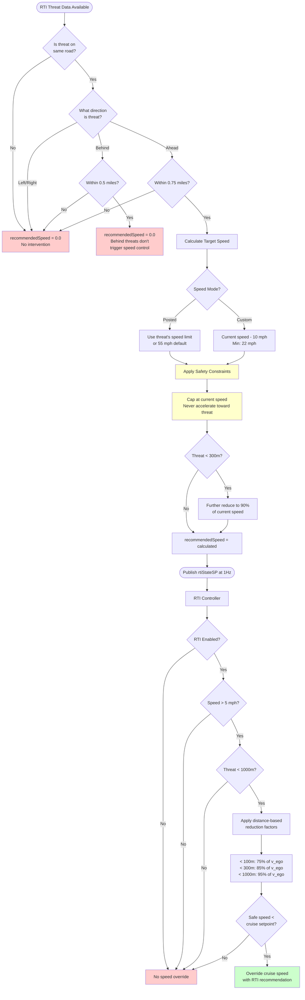

# RTI Speed Limit Decision Flowchart

## Visual Decision Flow



## Key Decision Points Explained

### 1. **Same Road Check** ⚡
- Uses distance-based heuristics (50m for roads, 200m for highways)
- Critical first filter - if not on same road, threat is ignored

### 2. **Direction Filter** 🧭
- **Ahead**: Primary trigger for speed control (0.75 mile range)
- **Behind**: Tracked but doesn't trigger speed control
- **Left/Right**: Completely ignored for speed decisions

### 3. **Distance Thresholds** 📏
- **Ahead threats**: 1207m (0.75 miles) default
- **Behind threats**: 805m (0.5 miles) - for tracking only
- Configurable via parameters

### 4. **Speed Calculation** 🚗
- **Posted mode**: Uses actual speed limit from threat location
- **Custom mode**: Reduces current speed by fixed amount
- **Safety cap**: ALWAYS ≤ current speed (no acceleration)

### 5. **Progressive Reduction** 📉
As threat gets closer, speed recommendation becomes more conservative:
- **300-1000m**: Target speed or 95% of current
- **100-300m**: Further reduced to 85% of current
- **< 100m**: Maximum reduction to 75% of current

### 6. **Publication Logic** 📡
- Published at 1Hz regardless of threat status
- `recommendedSpeed = 0.0` means "no recommendation"
- `threatAhead = true/false` indicates presence of ahead threat

### 7. **Controller Integration** 🎮
Additional safety checks in RTI Controller:
- Must be enabled via parameter
- Minimum operating speed (5 mph)
- Maximum activation distance (1000m)
- Only overrides if recommendation < cruise setpoint

## Quick Reference Table

| Condition | recommendedSpeed | threatAhead | Result |
|-----------|-----------------|-------------|---------|
| No threats | 0.0 | false | No intervention |
| Threat to side | 0.0 | false | No intervention |
| Threat behind | 0.0 | false | No intervention |
| Threat ahead > 0.75mi | 0.0 | false | No intervention |
| Threat ahead < 0.75mi | Posted speed or current-10mph | true | Speed override active |
| Very close threat (<300m) | 90% of current or less | true | Aggressive deceleration |

## API Rate Limiting

```
┌─────────────────────────────────────────────────────────┐
│                     Timeline (seconds)                   │
├────┬────┬────┬────┬────┬────┬────┬────┬────┬────┬─────┤
│ 0  │ 1  │ 2  │... │ 29 │ 30 │ 31 │... │ 59 │ 60 │ ... │
├────┴────┴────┴────┴────┴────┴────┴────┴────┴────┴─────┤
│ API │ Pub │ Pub │    │ Pub│ API│ Pub │    │ Pub│ API │
│Fetch│ 1Hz │ 1Hz │    │ 1Hz│Fetch│ 1Hz│    │ 1Hz│Fetch│
└─────────────────────────────────────────────────────────┘

API Fetches: Every 30 seconds (120 calls/hour max)
Publishing: Every 1 second (continuous)
Cache: Used between API calls (max 5 min staleness)
```

## Summary

The RTI system follows a strict, conservative decision tree that prioritizes safety. Speed limits are published to the longitudinal planner **only** when there's a clear, ahead threat on the same road within range, and the system **never** recommends acceleration toward a threat. The multi-layered validation ensures safe, predictable behavior in all driving scenarios.